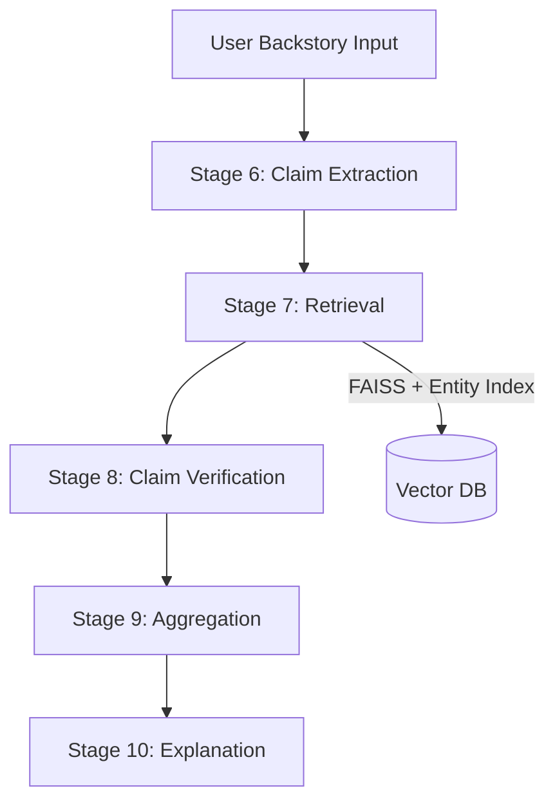
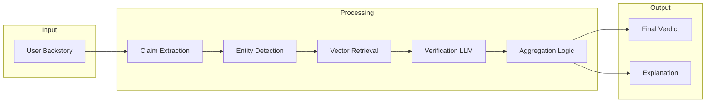

# Backstory Validation RAG

A Retrieval-Augmented Generation (RAG) system that verifies whether a user-provided fictional backstory is consistent with a source novel.

The system decomposes a backstory into atomic claims, retrieves relevant evidence, verifies each claim, and produces a final compatibility verdict with a structured explanation.

---

## Features

* Entity-aware retrieval (character grounded)
* Claim-level verification
* Deterministic reasoning combined with LLM-based explanation
* Final compatibility scoring
* Structured and human-readable output

---

## Pipeline Overview



---

## Detailed Pipeline

### Stage 6 — Claim Extraction

* Sentence splitting
* Clause decomposition
* Pronoun resolution
* Subject/entity carry-over
* Produces atomic claims

---

### Stage 7 — Retrieval

* Extract entity from each claim
* Perform entity-restricted search when possible
* Fallback to global semantic search
* Apply entity-level filtering to remove noise

---

### Stage 8 — Claim Verification

* Uses an LLM (Mistral via Ollama)
* Classifies each claim as:

  * SUPPORT
  * CONTRADICT
  * NOT_MENTIONED

---

### Stage 9 — Aggregation

Decision logic:

* Any contradiction → INCOMPATIBLE
* All supported → COMPATIBLE
* Otherwise → PARTIALLY_COMPATIBLE

---

### Stage 10 — Explanation

* Uses deterministic outputs from previous stages
* Generates a structured explanation using an LLM
* Provides suggestions to improve the backstory

---

## Architecture Diagram



---

## Example

### Input

Ayrton escaped the prison and killed the royals

### Output

Claim 1: Ayrton escaped the prison (VERDICT: SUPPORT)

* The evidence provided suggests that Ayrton left the prison, as indicated by Glenarvan's concern about Ayrton returning alone, Ayrton asking if they had been arrested, and the statement that Ayrton had not lost his time or trouble. This implies that Ayrton was indeed in prison before he managed to escape.
* To improve the backstory, it could be beneficial to provide more details about how Ayrton escaped from the prison.

Claim 2: Ayrton killed the royals (VERDICT: NOT_MENTIONED)

* The evidence provided does not support the claim that Ayrton killed the royals. Instead, it suggests that Glenarvan and others feared Ayrton might rob or assassinate them, but there is no direct statement or implication that Ayrton actually did so.
* To improve the backstory, it could be beneficial to either provide evidence supporting this claim or reconsider including it if there is no such evidence available.

---

## Tech Stack

* Python
* spaCy (NLP processing)
* FAISS (vector similarity search)
* Ollama (LLM inference)
* Nomic embeddings

---

## Project Structure

```
.
├── claimExtraction.py
├── claimRetrieval.py
├── verification.py
├── aggregation.py
├── explanation_llm.py
├── atomicChunks.json
├── entity.json
├── atomic.index
└── README.md
```

---

## Key Design Decisions

* Deterministic reasoning is used for correctness and consistency
* LLMs are used only for explanation, not decision-making
* Entity-grounded retrieval prevents semantic drift
* Claim-level validation enables fine-grained reasoning

---

## Future Improvements

* Coreference resolution for multi-entity tracking
* Multi-book support
* Interactive UI (Streamlit or web app)
* Stronger NLI-based verification
* Alias handling for characters

---

## Conclusion

This project demonstrates a complete RAG pipeline with structured reasoning, moving beyond simple retrieval to claim-level validation and explainability.

---

## Author

Yash Chawla
