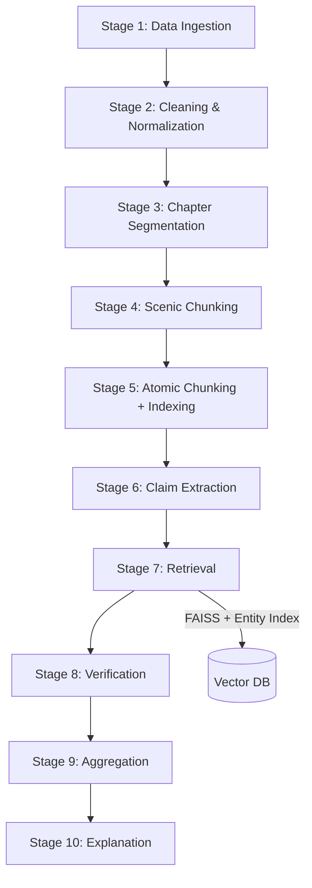
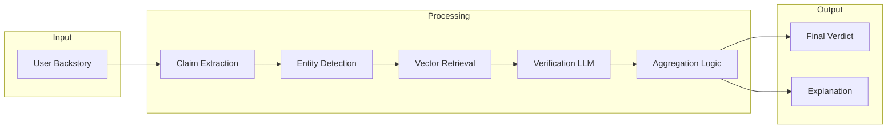

# Backstory Validation RAG

A Retrieval-Augmented Generation (RAG) system that verifies whether a user-provided fictional backstory is consistent with a source novel.

The system decomposes a backstory into atomic claims, retrieves relevant evidence, verifies each claim, and produces a final compatibility verdict with a structured explanation.

---

## Features

* Entity-aware retrieval (character grounded)
* Claim-level verification
* Deterministic reasoning combined with LLM-based explanation
* Final compatibility scoring
* Structured and human-readable output

---

## Repository

https://github.com/takeitezybaby/local-backstory-llm-RAG

---

## Pipeline Overview



---

## Full Pipeline

### Stage 1 — Data Ingestion

* Raw book text is converted into structured JSON format
* Each book is stored with metadata

---

### Stage 2 — Text Cleaning and Normalization

* Unicode normalization
* Fix encoding issues using `ftfy`
* Remove structural inconsistencies

---

### Stage 3 — Chapter Segmentation

* Regex-based chapter detection
* Handles Roman numerals and numeric formats
* Filters out index/table-of-contents noise

---

### Stage 4 — Scenic Chunking

* Paragraph grouping into chunks
* Maintains narrative continuity
* Applies word limits for chunk size

---

### Stage 5 — Atomic Chunking and Indexing

* Converts scenic chunks into factual atomic chunks
* Applies pronoun resolution and subject carry-over
* Generates embeddings using Nomic
* Builds FAISS vector index
* Creates entity-to-chunk mapping

---

### Stage 6 — Claim Extraction

* Splits backstory into atomic claims
* Resolves pronouns
* Maintains subject/entity consistency

---

### Stage 7 — Retrieval

* Entity-based retrieval when possible
* Global semantic fallback
* Post-filtering ensures entity consistency

---

### Stage 8 — Claim Verification

* Uses Mistral (via Ollama)
* Classifies claims as:

  * SUPPORT
  * CONTRADICT
  * NOT_MENTIONED

---

### Stage 9 — Aggregation

Decision logic:

* Any contradiction → INCOMPATIBLE
* All supported → COMPATIBLE
* Otherwise → PARTIALLY_COMPATIBLE

---

### Stage 10 — Explanation

* Uses deterministic results
* Generates structured explanation via LLM
* Suggests improvements

---

## Architecture Diagram



---

## Example

### Input

Ayrton escaped the prison and killed the royals

### Output

Claim 1: Ayrton escaped the prison (VERDICT: SUPPORT)

* The evidence provided suggests that Ayrton left the prison, as indicated by Glenarvan's concern about Ayrton returning alone, Ayrton asking if they had been arrested, and the statement that Ayrton had not lost his time or trouble. This implies that Ayrton was indeed in prison before he managed to escape.
* To improve the backstory, it could be beneficial to provide more details about how Ayrton escaped from the prison.

Claim 2: Ayrton killed the royals (VERDICT: NOT_MENTIONED)

* The evidence provided does not support the claim that Ayrton killed the royals. Instead, it suggests that Glenarvan and others feared Ayrton might rob or assassinate them, but there is no direct statement or implication that Ayrton actually did so.
* To improve the backstory, it could be beneficial to either provide evidence supporting this claim or reconsider including it if there is no such evidence available.

---

## Setup and Installation

### 1. Clone the repository

```bash
git clone https://github.com/takeitezybaby/local-backstory-llm-RAG.git
cd local-backstory-llm-RAG
```

---

### 2. Create virtual environment

```bash
python -m venv .venv
source .venv/bin/activate      # Linux / Mac
.venv\Scripts\activate         # Windows
```

---

### 3. Install dependencies

```bash
pip install -r requirements.txt
```

---

### 4. Install spaCy model

```bash
python -m spacy download en_core_web_sm
```

---

### 5. Install and run Ollama

Download from: https://ollama.com

Pull models:

```bash
ollama pull mistral:instruct
ollama pull mistral:7b
```

---

### 6. Run the pipeline

```bash
run_pipeline.bat
```

Note: The current execution script is a `.bat` file, so the project is **currently supported on Windows only**.
Linux/Mac support can be added by creating an equivalent `.sh` script.

---

## Tech Stack

* Python
* spaCy
* FAISS
* Ollama
* Nomic Embeddings

---

## Key Design Decisions

* Deterministic reasoning ensures correctness
* LLM used only for explanation, not decision-making
* Entity-grounded retrieval prevents semantic drift
* Claim-level validation enables fine-grained reasoning

---

## Future Improvements

* Coreference resolution for multi-entity tracking
* Multi-book support
* Interactive UI (Streamlit or web app)
* Stronger NLI-based verification
* Alias handling for characters

---

## Conclusion

This project implements a complete, end-to-end RAG pipeline that goes beyond traditional retrieval systems by incorporating structured reasoning and explainability.

Instead of relying solely on semantic similarity, the system:

* Breaks user input into atomic claims
* Grounds retrieval using entity-aware filtering
* Verifies each claim independently using an LLM
* Aggregates results using deterministic logic
* Generates human-readable explanations

This hybrid design ensures both accuracy and interpretability, where:

* Deterministic components guarantee reliability
* LLM components enhance usability and clarity

The system highlights a practical approach to building trustworthy AI pipelines, where LLMs are used as reasoning assistants rather than decision-makers.

While currently optimized for a single-book setup and Windows execution, the architecture is modular and can be extended to:

* Multi-book or multi-domain knowledge bases
* More advanced coreference and entity resolution
* Interactive interfaces or APIs

Overall, this project demonstrates how combining retrieval, structured logic, and controlled LLM usage can produce a robust and explainable validation system.
